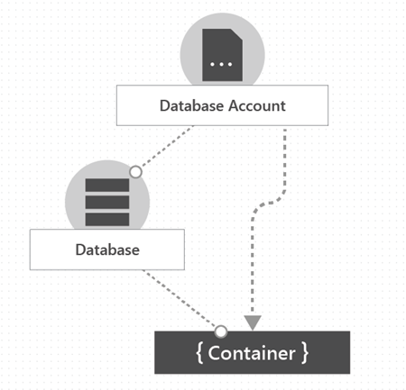
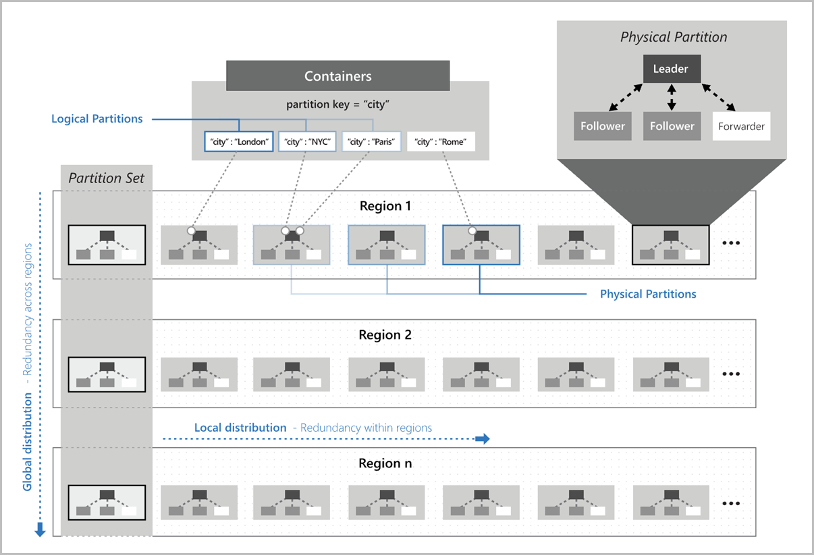
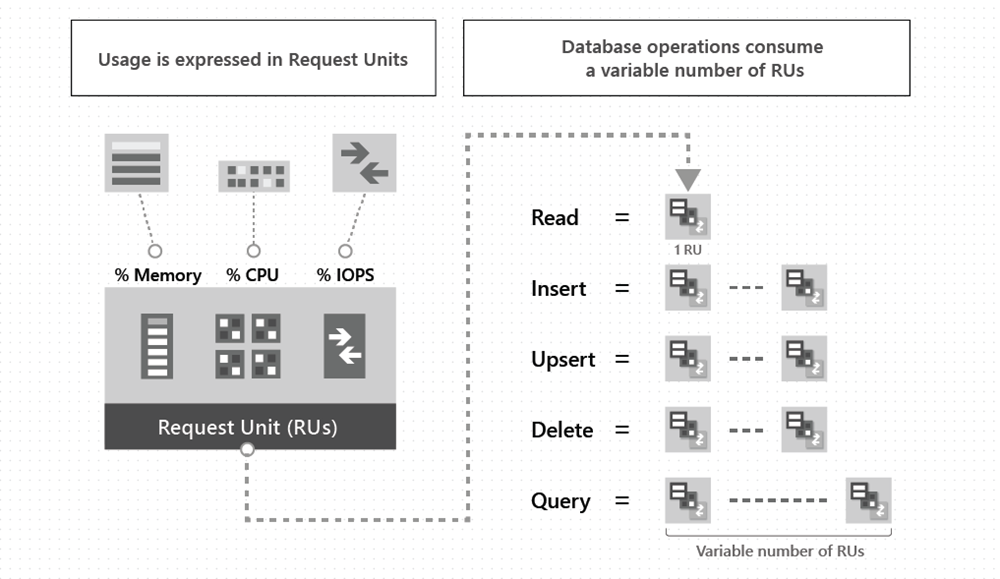
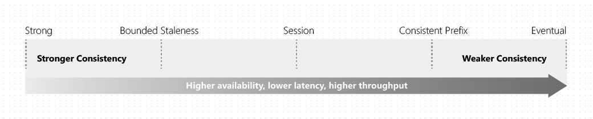

# Cosmos

Cosmos is multi model No SQL (not just SQL) that designed to globally distributed to multiple nodes. 

Azure Cosmos DB offers multiple database APIs, which include NoSQL, MongoDB ( document structure), PostgreSQL (Relational) , Cassandra (column-oriented schema), Gremlin (graph), and Table (key values). API for NoSQL is native to Azure Cosmos DB so get the latest and greatest sooner compared to the other API's

The advantages here: 
- High latency: Data can be close to where it's needed e.g. the API or user 
- Highly available due to having multiple copies 
- The way partition keys are used it could scale horizontally allows for high scalability because load is spread across multiple nodes. Instead of having one large SQL relational database. 

> [!NOTE] 
> You're able to shared a relational database across multiple servers to allows for horizontal scaling, but you will need coordination with syncing schema changes and directing data to specific instances and having an application that would distribute the shared based on `shared key`. Cosmos allows managed environment that handles this for you. Also schema not being as strict compared to typical relational databases.
## Cosmos Architecture 
**Azure Database Account** -  account contains all of your Azure Cosmos DB resources: databases, containers, and items. Database account can have multiple databases.

**Database** - is similar to a namespace. A database is simply a group of container.

**Container** - is where data is actually held. Data is stored on one or more servers called _partitions_. Which use *Partition key* which help Azure Cosmos DB distribute the data efficiently across partitions. You can also use the partition key in the `WHERE` clause in queries for efficient data retrieval.

> [!NOTE] 
> To scale cosmos db more partitions are added which is managed by cosmos.

- **Physical Partitions** are an internal implementation of how Azure cosmos store your data and Azure Cosmos DB entirely manages physical partitions. You don't interact with this.
  
- **Logical Partitions** -  Azure cosmos db abstracts the physical partition away from you and you interact with logical partitions that use the partition key. 

## RU (Request Unit)
Request unit represent: CPU, Input/Output (IOPS) and memory required to preform a database operation. Measures cost based on throughput (Request Units per second, RU/s). Reading single item using partition key and id should be 1RU if it's under 1kb in size. 

A 1KB text example is approximately the length of a short email, a few paragraphs, or around 160-200 words in plain English. 

Types of database determines what RU are charged: 
- **Provisioned throughput** : You manage RTU for your application in multiple of 100 RU per seconds. 
- **Serverless** : Billed on RU you use 
- **Autoscale**: Scale RU based on usage

## Consistency Level
Consistency model determines how data is replicated across nodes.

**Strong Consistency** - Data is available in all nodes in the same time. Strong consistency increases write latencies because data must replicate and commit across large distance and also reduces availability during failures because data can't replicate and commit in every region.

Latency is for one request, multiple request could be made which increase overall time exponentially. 

**Eventual Consistency**- They will eventually be in-sync, but will take a longer time. Offers higher availability and better performance, but it's more difficult to program applications because data might not be consistent across all regions.

Based on your applications you will make different trade offs on what model to choose.

**Strong Consistency** - reads are guaranteed to get the most recent commit, but since data will need to commit to all regions so could have some latency issues based on distance to regions. 

**Bounded staleness consistency (Read/Write Replica)** - Similar to strong, but you could configure how much the read copies could lag behind:
- **K** - number of updates if could lag behind the writes
- **T** - Time interval that it could lag behind the writes

Bounded staleness is primarily beneficial to single-region write accounts with two or more regions. Once you're getting close to the time window Cosmos will throttle and not accept any writes. To allow replication engine to catch up.

**Session Consistency** - The default for cosmos db. Read your own writes. 

**Consistent Prefix** - Guarantees reads which lag behind will appear in the order which they are written in. 

**Eventual Consistency** - Doesn't guarantee ordering, but data will eventually all be there.

