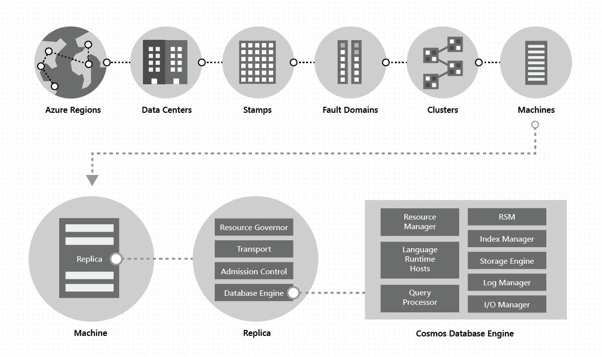

# Cosmos
Cosmos is multi model No SQL (not just SQL) that designed to globally distributed to multiple nodes. 

Azure Cosmos DB offers multiple database APIs, which include NoSQL, MongoDB (document structure), PostgreSQL (Relational) , Cassandra (column-oriented schema), Gremlin (graph), and Table (key values). 

> [!NOTE] 
> API for NoSQL is native to Azure Cosmos DB so get the latest and greatest sooner compared to the other API's

The advantages here: 
- Low latency: Data can be close to where it's needed e.g. the API or user 
- Highly available: due to having multiple copies in each region
- The way partition keys are used it could scale horizontally allows for high scalability because load is spread across multiple physical partitions.

> [!NOTE] 
> You're able to shared a relational database across multiple servers to allows for horizontal scaling, but you will need coordination with syncing schema changes and and having a mechanism to distribute data based on a *Shared Key*. Cosmos allows managed environment that handles this for you. Also schemas are not as strict compared to typical relational databases.
## Cosmos Architecture 

Each region contains all the data partitions of an Azure Cosmos DB container and can serve reads as well as serve writes when multi-region writes is enabled. If your Azure Cosmos DB account is distributed across _N_ Azure regions, there will be at least _N_ x 4 copies of all your data.

**Fault Domain** - makes sure the VMs don't share the same hardware, so for example if the switch dies, it won't take down your whole infrastructure but only a small part of it. 

Machines within a cluster are typically spread across 10-20 fault domains for high availability within a region

Data in an Azure Cosmos DB container is automatically indexed upon ingestion. Automatic indexing enables users to query the data without the hassles of schema or index management, especially in a globally distributed setup.

In a given region, data within a container is distributed by using a partition-key, which you provide and is transparently managed by the underlying physical partitions

Data within a container is distributed along two dimensions - within a region and across regions, worldwide:

Each machine hosts hundreds of replicas that correspond to various physical partitions

Each replica hosts an instance of Azure Cosmos DB’s database engine, which manages the resources as well as the associated indexes. 

Azure Cosmos DB achieves full schema agnosticism by automatically indexing everything upon ingestion in an efficient manner, which allows users to query their globally distributed data

To provide durability and high availability, the database engine persists its data and index on SSDs and replicates it among the database engine instances within the replica-set(s) respectively.

**Replica Set** self-managed and dynamically load-balanced group of replicas spread across multiple fault domains. The replica-set membership _N_ is dynamic – it keeps fluctuating between _NMin_ and _NMax_ based on the failures, administrative operations, and the time for failed replicas to regenerate/recover

First, the cost of processing the write requests on the leader is higher than the cost of applying the updates on the follower. We avoid contacting the leader for serving reads unless required.

**Partition Set**- A group of physical partitions, one from each of the configured with the Azure Cosmos DB database regions. Is composed to manage the same set of keys replicated across all the configured regions. While a given physical partition (a replica-set) is scoped within a cluster, a partition-set can span clusters, data centres, and geographical regions owning the same set of keys. Similar to a replica-set, a partition-set’s membership is also dynamic – it fluctuates based: operations to add/remove new partitions to/from a given partition-set, add/remove a region to your Azure Cosmos DB database, or when failures occur. This is self healing and have several back ups lead to having such a high SLA 99.99%

The service allows you to configure your Azure Cosmos DB databases with either a single write region or multiple write regions, and depending on the choice, partition-sets are configured to accept writes in exactly one or all regions.

**Azure Database Account** -  account contains all of your Azure Cosmos DB resources: databases, containers, and items. Database account can have multiple databases.

**Database** - is similar to a namespace. A database is simply a group of container.

**Container** - is where data is actually held. Data is stored on one or more servers called _partitions_. Which use *Partition key* which help Azure Cosmos DB distribute the data efficiently across partitions. You can also use the partition key in the `WHERE` clause in queries for efficient data retrieval. When a partition consumes more storage, Azure Cosmos DB transparently handles partition management operations (split, clone, delete) across all the regions if the max size has been exceeded. 

> [!NOTE] 
> To scale cosmos db more partitions are added which is managed by cosmos.

- **Logical Partition** -  A container has set of logical partitions which use the same partition key, but have different values. Container partition key is `City`  and one logical partition would bee  `"city" : "London"` . This data could be stored in multiple physical partitions. Each logical partition can store up to 20 GB of data.  Once the max size is reach cosmos managed environment would split this up more logical partitions. 

**Physical Partitions** - are an internal implementation of how Azure cosmos store your data. A physical partition is implemented by a group of replicas, called a _replica-set_.

Each replica set has 4 nodes which all have the copy of the data:
1) **Leader** - process the write operations
2) **Followers** - Gets updates from the leader
3) **Forwarder** - Is also a follower, but also has the responsibility to forward the updated data to the leader of the replica set in to other regions.

Due to replica set we have 4 copies our data our local region. If we want have data to be closer to our users we deploy a replica set of 4 nodes is copied to that region. Cosmos managed environment with the forward will allow data to be kept up to date depending on the consistency model you choose.
## RU (Request Unit)
Request unit represent: CPU, Input/Output (IOPS) and memory required to preform a database operation. Measures cost based on throughput (Request Units per second, RU/s). Reading single item using partition key and id should be 1RU if it's under 1kb in size. 

A 1KB text example is approximately the length of a short email, a few paragraphs, or around 160-200 words in plain English. 

Types of database determines what RU are charged: 
- **Provisioned throughput** : You manage RTU for your application in multiple of 100 RU per seconds. 
- **Serverless** : Billed on RU you use 
- **Autoscale**: Scale RU based on usage

## Consistency Level
Consistency model determines how data is replicated across nodes.

**Stronger Consistency** - Data is available in all nodes in the same time. Strong consistency increases write latencies because data must replicate and commit across large distance and all nodes. 

- This reduces availability during failures because data can't replicate and commit in every region.
- Latency - if data is deployed to multi region the data will need to each all to all these region and update all NX4 nodes.  The diagram shows the latency of one request, multiple request could be made which increase overall time exponentially. 

**Weaker Consistency**- They will eventually be in-sync, but will take a longer time. Offers higher availability and better performance, but it's more difficult to program applications because data might not be consistent across all regions.

Based on your applications you will make different trade offs on what model to choose.

### 5 Consistency Models
**Strong Consistency** - reads are guaranteed to get the most recent commit, but since data will needs to commit to all regions and nodes it can have some latency issues.

**Bounded staleness consistency (Read/Write Replica)** - Similar to strong, but you could configure how much the read copies could lag behind:
- **K** - number of updates it could lag behind the writes
- **T** - Time interval that it could lag behind the writes

Once you're getting close to the time window Cosmos will throttled and not accept any writes. To allow replication engine to catch up.

**Session Consistency** - The default for cosmos db. It ensures that **within a client session**, a user will always read their own writes. When a client connects to cosmos is session token is issued. This token passed onto Cosmos to ensure what you've written is returned. This more of client side model than how data is replicated. 

**Consistent Prefix** -  Reads will lag behind your writes. So you won't see your changes straight away like session consistency, but the order will still be maintained.

**Eventual Consistency** - Doesn't guarantee ordering, but data will eventually all be there.

> [!NOTE]
> If your Azure Cosmos DB account is distributed across _N_ Azure regions, there will be at least _N_ x 4 copies of all your data. You have 4 replicas to ensure high availability, fault tolerance, and strong consistency guarantees. Any times you make changes your data is committed to 3/4 replicas. The last one gets hydrated and gets updated in the background.
> 
> **Strong and Bounded** : Reads from two replicas. When you read both replicas you can read logical sequence number (LSN) and compare them. If they're the same value you're reading the strongest set of data that has been written in. If they're not the same you return the data with the highest LSN (the most recent data). Since it reads from two replicas the RU cost is doubled.
> 
> **Session, consistent prefix, eventually**: Read only from a single replica
> 

