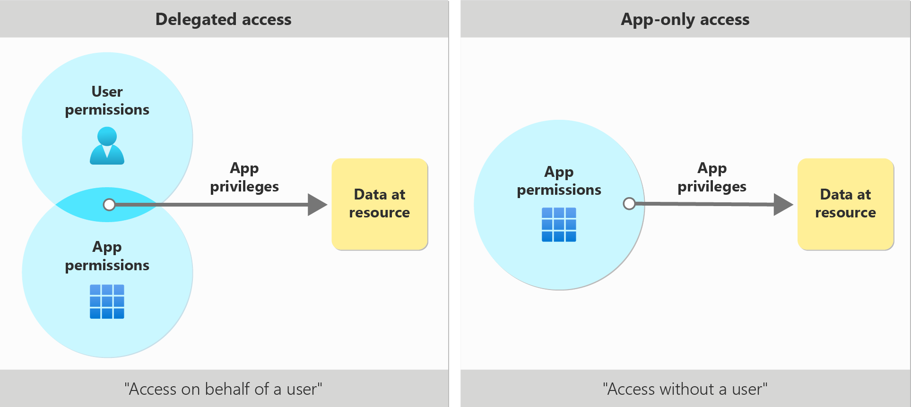
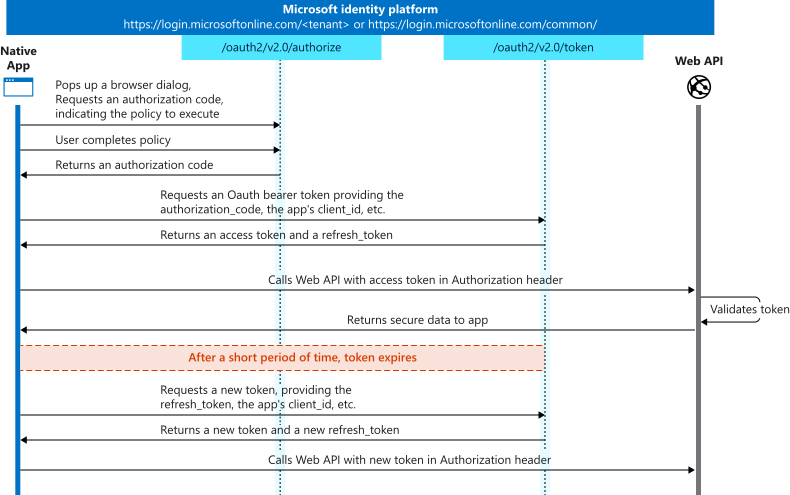
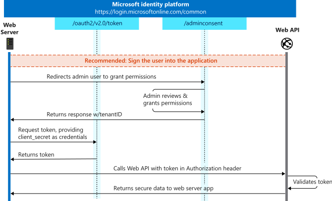

# Identity Platform


The identity platform consists of: 
- **Application Registration** -  Registering your application in Microsoft Entra establishes a trust relationship between your app and the Microsoft identity platform. This will allow your application to authenticate users. 
  
- **Client SDK -** SDK provided by Microsoft to integrate authentication and token acquisition into your applications using OAuth 2.0 and OpenID Connect flows.  Also single sign on which allows you  to use multiple service in Microsoft without needing to re-login. They're all use the same authentication session. You could use the SDK to customise your login experience. 

```c#
using Microsoft.Identity.Client;

//Details from Application Registration
string clientId = "<YOUR_CLIENT_ID>";
string tenantId = "<YOUR_TENANT_ID>";
string redirectUri = "https://localhost:5001/signin-oidc";

string authority = $"https://login.microsoftonline.com/{tenantId}";

// Create Public Client for interactive login
var app = PublicClientApplicationBuilder.Create(clientId)
	.WithRedirectUri(redirectUri)
	.WithAuthority(authority)
	.Build();

// Scopes for delegated permissions
string[] scopes = new string[] { "User.Read" };

//Give me an access every permission that an admin has already granted to my application for that API.
string[] scopes = new string[] {"/.default"" };

// Acquire token interactively
var result = await app.AcquireTokenInteractive(scopes)
	.ExecuteAsync();

var token = result.AccessToken;
```

Cookies for authentication session:
  


- **Endpoint**  - That are used to authentication dance to get token. 
- **Audience** - Depending on the audience you will use different backend services.
## Application Registration 
Registering your application in Microsoft Entra establishes a trust relationship between your app and the Microsoft identity platform. Once you register your application, it gets assigned the `User.Read` scope which allows an app to **sign in the user and read their profile**.

> [!NOTE] 
> A scope is essentially a **string identifier** for a permission or group of permissions.

This is a list of scopes available in the app registration. Some request could be set to be manually approved by the home tenant admin if it's asking for high privilege scope.


During application registration in the home tenant an application registration is created and also  a service principle. If it's multi tenant once a user signs in a service principle is created in that tenant.


The reason for multiple service principles in each tenant admin can manage their own permissions.
- Tenant A might grant `User.Read`.
- Tenant B might grant `User.Read` + `Mail.Read`.

Here is an example of approval needed from an admin on their local tenant because this flow requires a certain set of scopes.


You could also set No admin approval for certain scopes and let the user accept them on their end.
Except if the type is an application permission which is always admin approved. This type of permission will be discussed later.


## Types of Permissions  

**Delegated Access** - The client application access the resource on behalf of the user.  The application will generate token on behalf of user if they approve and use it to access the resource. The user will be need to have RBAC role access to resource.

**Delegate permission** - An application that is granted the `user_impersonation` . The application is only able to act **on behalf of a user** rather than as itself.

**App only Access**  : Application acts on its own with no user signed in users. The client app must be granted appropriate application permissions of the resource app it's calling e.g. *Machine to Machine flow*.  The app itself will need to have RBAC access.

**Application Permission** -   are used in the app-only access scenario, without a signed-in user present. Always needs admin approval.

You can configure scope permission in the allowed to have on API Permissions tab.  
- *Delegate*:  Can have admin consent 
- *Application* : Must have admin consent and must be approved by the admin on their local tenant.



## Consent 
- **User consent** - A user can authorize an application to access some data at the protected resource, while acting as that user.
	- *Static User Consent* - All permissions are asked ahead of time. Bad user experience and feels suspicious to give all these permissions up in one go. 
	- *Dynamic User Consent* - Only when that permission is about to be used.
- **Administrator consent**  - Only on administrator end and will have to wait for a response 
- **Preauthorization** enables a resource application owner to grant permissions without requiring users to see a consent prompt for the same set of permissions that are preauthorized
## Conditional Access 
Conditional Access is Microsoft's Zero Trust policy engine taking signals from various sources into account when enforcing policy decisions.
Common applied Polices:
- Multifactor authentication
- Allowing only Intune enrolled devices to access specific services
- Restricting user locations and IP range
## Authentication Flow

### Authorisation Code Flow with PKCE (MSAL.js)
Runs on an untrusted client where secrets cannot be stored.  This will using the signed in user identity to access the resource and is seen as *delegates access*.


### Client Credential Flow (MSAL.NET)
Application is a machine to machine interaction with a service  that sits in your infrastructure and secrets are safe in these environments.  Once permission is approved by admin it can generate token and use it based on the resource identity in a non interactive way (without open browser) . This is seen as *application only access*



## Microsoft 365