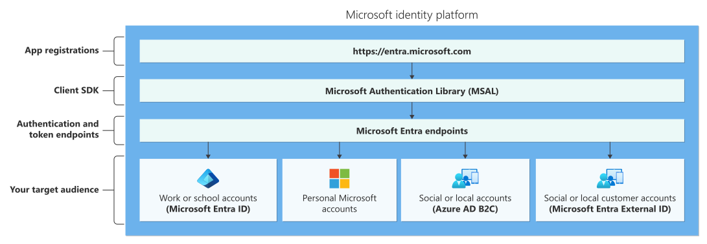

# Identity Platform



The identity platform consists of: 
- **Application Registration** -  Registering your application in Microsoft Entra establishes a trust relationship between your app and the Microsoft identity platform. This will allow your application to authenticate users. 
  
- **Client SDK -** SDK provided by Microsoft to integrate authentication and token acquisition into your applications using OAuth 2.0 and OpenID Connect flows.  Also single sign on which allows you  to use multiple service in Microsoft without needing to re-login. They're all use the same authentication session. You could use the SDK to customise your login experience. 

```c#
using Microsoft.Identity.Client;

//Details from Application Registration
string clientId = "<YOUR_CLIENT_ID>";
string tenantId = "<YOUR_TENANT_ID>";
string redirectUri = "https://localhost:5001/signin-oidc";

string authority = $"https://login.microsoftonline.com/{tenantId}";

// Create Public Client for interactive login
var app = PublicClientApplicationBuilder.Create(clientId)
	.WithRedirectUri(redirectUri)
	.WithAuthority(authority)
	.Build();

// Scopes for delegated permissions
string[] scopes = new string[] { "User.Read" };

// Acquire token interactively
var result = await app.AcquireTokenInteractive(scopes)
	.ExecuteAsync();

var token = result.AccessToken;
```

Cookies for authentication session:
  


- **Endpoint**  - That are used to authentication dance to get token. 
- **Audience** - Depending on the audience you will use different backend services.
## Application Registration 
Registering your application in Microsoft Entra establishes a trust relationship between your app and the Microsoft identity platform. Once you register your application, it gets assigned the `User.Read` scope which allows an app to **sign in the user and read their profile**.

> [!NOTE] 
> A scope is essentially a **string identifier** for a permission or group of permissions.

This is a list of scopes available in the app registration that can be requested from other tenants. Some request could be set to be manually approved by the home tenant admin if it's asking for high privilege scope.


During application registration in the home tenant an application registration is created and also  a service principle. If it's multi tenant once an use signs in a service principle is created in that tenant.


The reason for multiple service principles in each tenant may only be able to perform a set of actions/ scopes. This is stored as **OAuth2PermissionGrants** linked to the Service Principal.
- Tenant A might grant `User.Read`.
- Tenant B might grant `User.Read` + `Mail.Read`.

Here is an example of approval needed from an admin in the home tenant because this flow requires a certain set of scopes.


You could also set No admin approval for certain scopes. 

